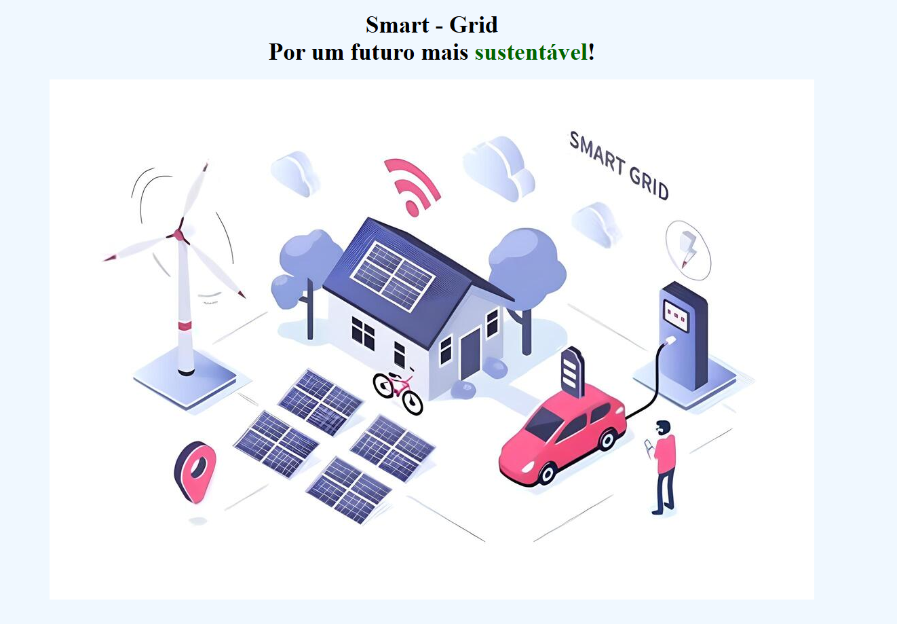

# Energia Verde - Projeto de Website

Este é um site informativo desenvolvido para promover a **Energia Verde**, uma startup focada em soluções energéticas sustentáveis utilizando **redes inteligentes**. O projeto tem como objetivo divulgar a missão, visão, valores, soluções e impactos das tecnologias de redes inteligentes para o futuro da energia.

## Funcionalidades

- **Home**: Página inicial com informações gerais sobre a empresa e seu impacto no setor energético.
- **Sobre**: Detalhes sobre a missão, visão e valores da empresa.
- **Solução**: Explicações sobre as soluções oferecidas, como redes inteligentes e energias renováveis.
- **Login**: Sistema de login para os usuários acessarem conteúdo exclusivo.
- **Contato**: Página para que os usuários entrem em contato com a empresa.
- **Quiz**: Uma página interativa para testar os conhecimentos dos usuários sobre energia sustentável.

### Funcionalidades Adicionais

- **Troca de Cor**: O site permite que o usuário altere a cor do tema através de botões interativos (azul, vermelho, roxo).
- **Links para Redes Sociais**: O site tem ícones para as redes sociais da empresa, como Instagram e Facebook.
- **Responsividade**: O layout do site se adapta a diferentes tamanhos de tela, oferecendo uma boa experiência tanto em dispositivos móveis quanto em desktops.

## Tecnologias Utilizadas

- **HTML5**: Estruturação da página web.
- **CSS3**: Estilização visual do site, com uso de classes e IDs para garantir um design limpo e moderno.
- **JavaScript**: Implementação de funcionalidades interativas como a troca de cor e integração com redes sociais.

### Características principais da Smart Grid:
1. **Tecnologia Digital**: As redes inteligentes utilizam sensores, medidores inteligentes e sistemas de comunicação digital para coletar dados em tempo real e otimizar a distribuição de energia. Isso permite monitoramento e controle detalhado das operações da rede elétrica.

2. **Eficiência Energética**: A principal vantagem de uma Smart Grid é a capacidade de melhorar a eficiência energética. Ela permite a otimização do fluxo de eletricidade, reduzindo desperdícios e minimizando o uso de fontes de energia não renováveis.

3. **Integração de Fontes Renováveis**: Uma das maiores vantagens das Smart Grids é a capacidade de integrar fontes de energia renováveis, como solar e eólica, à rede elétrica. Essas fontes de energia são intermitentes (ou seja, a produção de energia varia ao longo do dia e conforme as condições climáticas), mas as redes inteligentes podem ajustar o consumo de acordo com a disponibilidade dessas fontes.

4. **Monitoramento em Tempo Real**: Sensores e medidores inteligentes permitem o monitoramento da rede em tempo real, ajustando automaticamente o consumo e distribuindo a energia de forma eficiente, o que também ajuda a reduzir as perdas energéticas.

5. **Resposta à Demanda**: As redes inteligentes podem ajustar automaticamente a demanda de energia, gerenciando picos de consumo e evitando sobrecargas no sistema. Elas também podem permitir tarifas dinâmicas, incentivando os consumidores a usar energia em horários de baixa demanda.

6. **Resiliência**: Em casos de falhas ou desastres naturais, as redes inteligentes podem identificar rapidamente os problemas e redirecionar a energia para as áreas afetadas, garantindo maior resiliência e continuidade do fornecimento.

### Benefícios das Smart Grids para a Energia Verde:
- **Integração de Energias Renováveis**: As redes inteligentes permitem uma melhor integração de fontes renováveis, como energia solar e eólica, facilitando a transição para um sistema energético mais sustentável.
- **Redução de Emissões de CO₂**: Ao melhorar a eficiência energética e reduzir o desperdício, as Smart Grids ajudam a diminuir a quantidade de energia gerada a partir de fontes fósseis, contribuindo para a redução das emissões de CO₂ e a mitigação das mudanças climáticas.
- **Redução de Custos**: A otimização da distribuição de energia e a eliminação de perdas energéticas resultam em custos mais baixos tanto para os consumidores quanto para os fornecedores de energia.

As Smart Grids são uma parte fundamental da transição para um sistema de energia mais verde e sustentável, e sua implementação pode transformar o setor energético global.

## Estrutura de Arquivos

- **index.html**: Página inicial.
- **sobre.html**: Página sobre a missão, visão e valores da empresa.
- **solucao.html**: Página sobre as soluções oferecidas pela empresa.
- **login.html**: Página de login.
- **contato.html**: Página de contato.
- **quiz.html**: Página de quiz interativo.

## Autores

- Vitor de Lima Domingues(RM561008)
- João Pedro Vieira de Morais(RM560527)

## Link para o repositório no Github

- Repositório git: https://github.com/VitorLimaDomingues/Global-Solution-Web-Development

## Link para o GitPages

- Página hospedada no GitPages: https://vitorlimadomingues.github.io/Global-Solution-Web-Development/